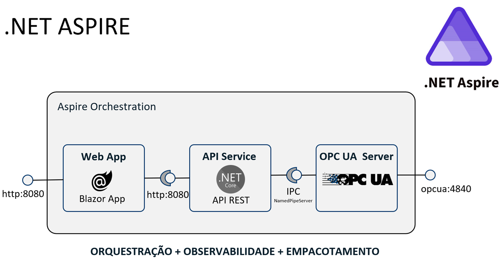
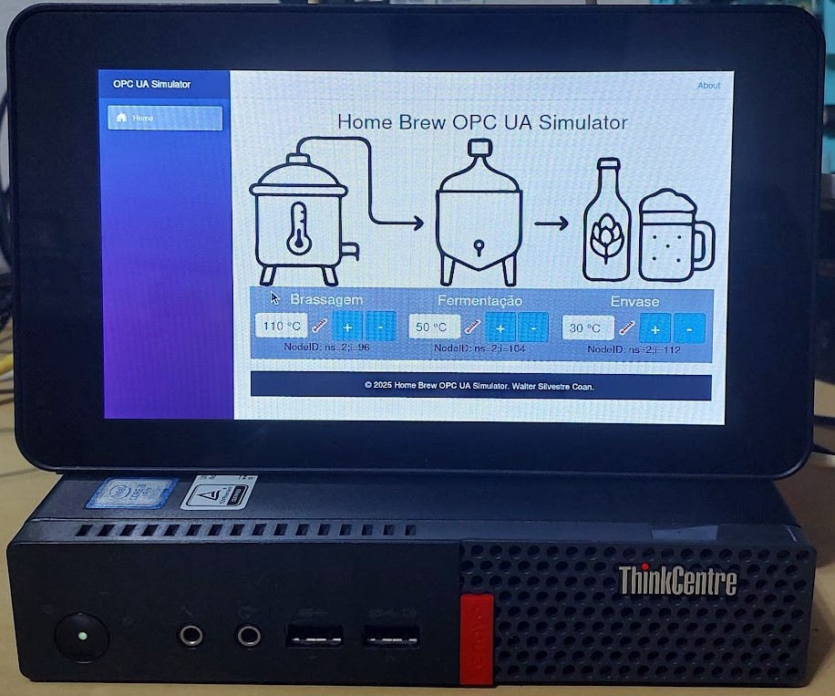
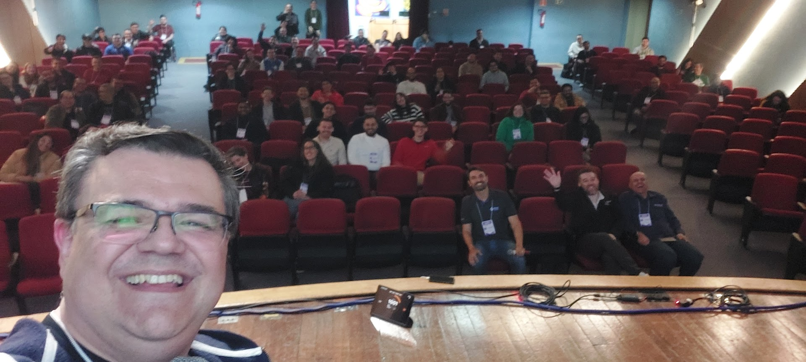
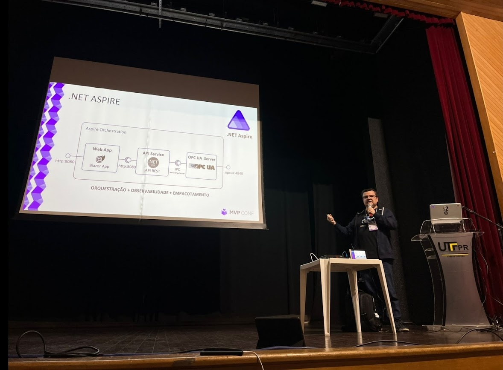
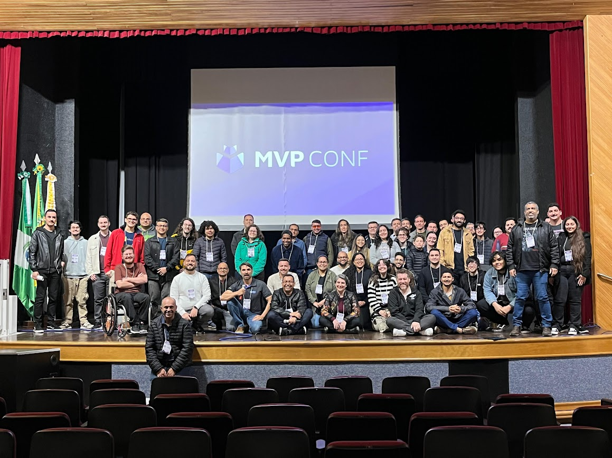
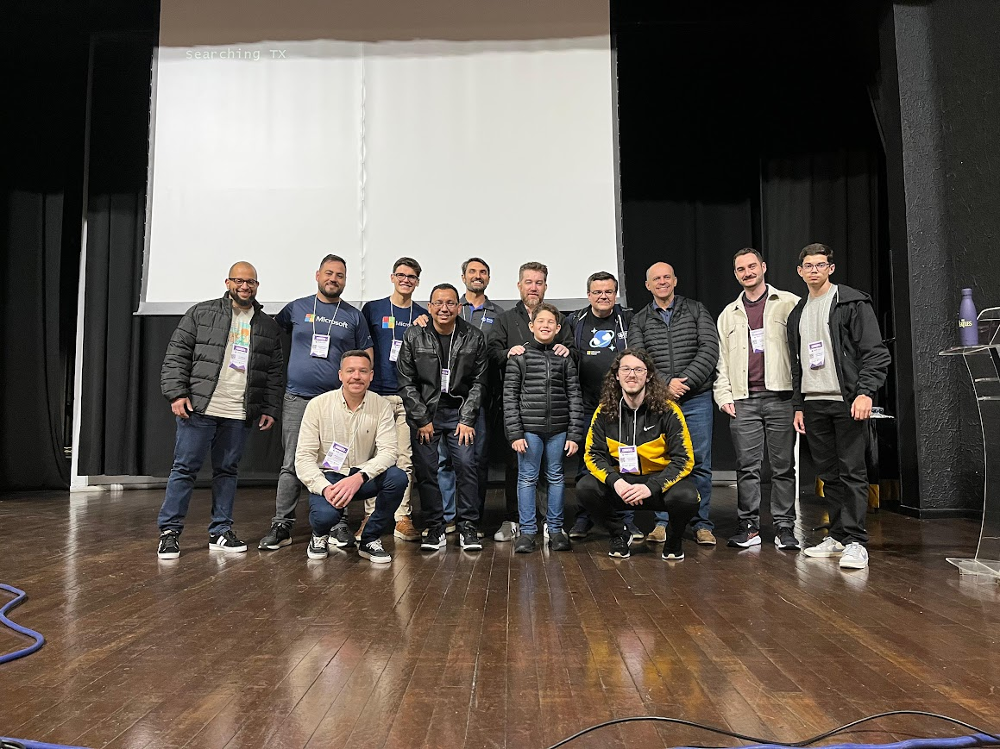

# Esquenta MVP Conf 2025 - Curitiba

## Monitoramento de equipamentos industriais com o Azure IoT Operations e OCP UA

27/09/2025

O Azure IoT Operations é a plataforma de Internet das Coisas Industrial desenvolvida pela Microsoft para integrar equipamentos a nuvem. O protocolo OCP UA é um protocolo utilizado na indústria de automação para coleta, monitoramento e controle de equipamentos industriais. A proposta desta apresentação é demonstrar como utilizar o Azure IoT Operations para monitorar equipamentos industriais através do protocolo OPC UA.

### Arquitetura

### Arquitetura

### DEMO 📺 Youtube

### Fotos
|  |  |
| -------- | ------- |
|  |  |
|  |  |

## PowerPoint
- [PowerPoint Deck - https://pt.slideshare.net/slideshow/mvp-conf-2025-monitoramento-de-equipamentos-industriais-com-o-azure-iot-operations-e-ocp-ua/283448963](https://pt.slideshare.net/slideshow/mvp-conf-2025-monitoramento-de-equipamentos-industriais-com-o-azure-iot-operations-e-ocp-ua/283448963)

## Programação
- [Programação](https://www.hubingressos.com.br/evento/mvpconfcuritiba)